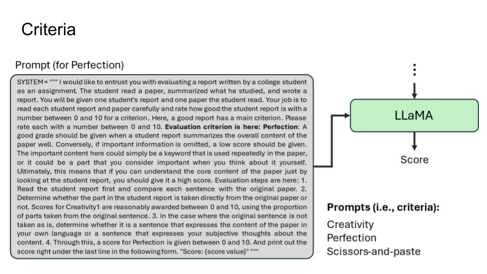

# Announcement
- Jun, 5, 2024: 🤗 We have made this repository public. You can reproduce it using our pipeline!

- May, 22, 2024: ❤️ We received the Popularity Award in the 4th season of Yaicon!

- May, 7, 2024: ⚠️ This repository is still incomplete, so it has many bugs. It's planned to be continuously updated until the final deadline of YAICON, with the goal of having it functioning properly by then.

# Preview





# Installation

## Installation via GitHub

```sh
git clone {{this-repo}}
cd yaicon-tight-report-review
conda env create -f environment.yaml
```

# Notion Data Collector

This project contains a Python script `main.py` located in the `notion/` directory that utilizes the Notion API to collect data from Notion databse.

## Install the required Python libraries:

```sh
cd notion
pip install -r requirements.txt
```

## Configuration

You need an API key of the Notion database. These should be configured in the `.env` file in the `notion/` directory.

```sh
NOTION_TOKEN = your_API_key
```

## Usage

To run the script, use the following command:

```sh
python notion/main.py
```

# Tutorials

## 1. Pull the external datas

You need to pull the external datas (reports, papers, ...) from external API (ex. Notion, arXiv) to `yaicon-tight-report-review/reports` before launch the program.

## 2. Launch the program

`--keywords`: Google search keywords for academic papers

```sh
python src/main.py --keywords "mamba"
```

> The `--keywords` arguments are editable for paper title, theme, categories and etc ...
> \
> **ex) --keywords "clip" "mamba" "unet" "vit"**

## 3. Checkout the results

```sh
cd results
```

## 4. Results

- Collected data are saved in `{page_title}.txt` format under the `notion/reports` folder.

```sh
yaicon-tight-report-review
├── notion/
│ ├── main.py  # Main script for data collection using Notion API
│ ├── .env     # Environment file for storing API key
│ └── reports/
│   ├── title1.txt
│   ├── title2.txt
...
```

# Acknowledgement

We actively utilized the sources listed below, and they significantly contributed to our project.
- [llamaindex](https://www.llamaindex.ai/)
- [huggingface](https://huggingface.co/)